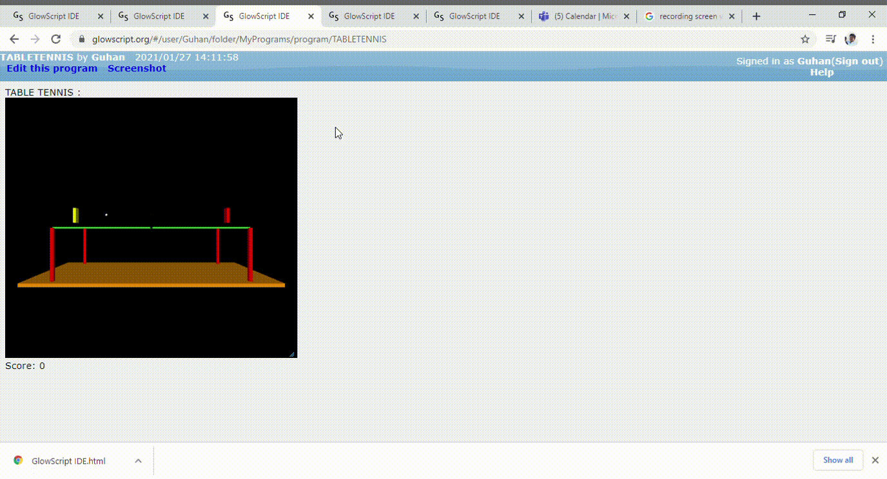

# Vpython
This contains my cool 3D vpython projects 

## Bouncer Game

## Demo   
[See Demo](https://glowscript.org/#/user/Guhan/folder/MyPrograms/program/PINGBOUNCE)

Here the acceleration increases over time as well as the Game moves On . Increasing the toughness of the game

Find this code in the bouncer repository.

## Ping Pong Game

## Demo   
[Demo](https://glowscript.org/#/user/Guhan/folder/MyPrograms/program/PINGBOUNCE)

Move the rackets to keepthe ball in game , it goes out then you too

Find this code in the pingpong repository.
